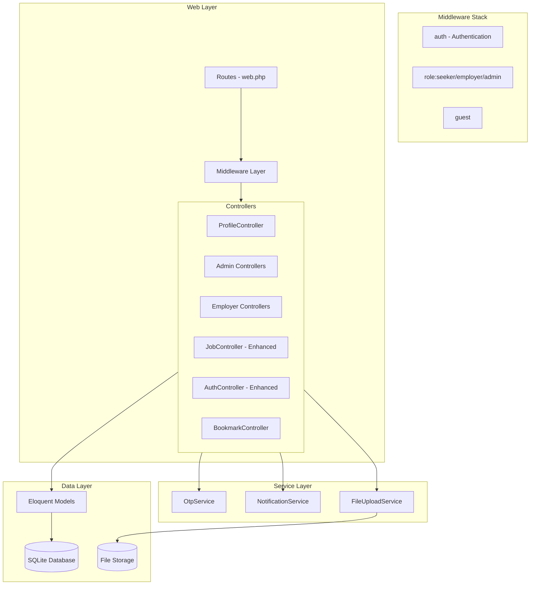
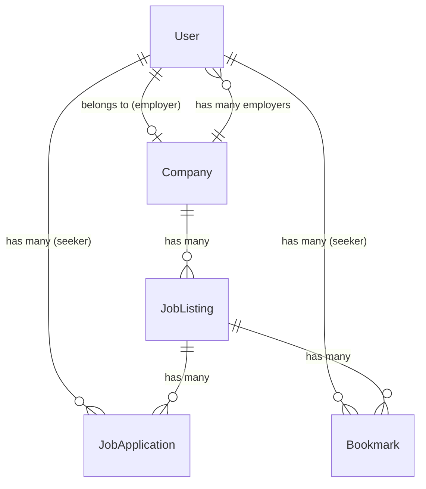

# Design Document: Full Platform Features

## Overview

This design covers the comprehensive enhancement of the Job Hub Laravel application to support a multi-role platform with distinct user experiences for Seekers, Employers, and Admins. The enhancement introduces role-based access control, user profiles with application tracking, an employer portal for job management, an admin panel for platform oversight, job bookmarks, email notifications, enhanced search filters, and login redirect preservation.

The system builds on the existing Laravel 13 application using Blade templates, Alpine.js for interactivity, and Tailwind CSS for styling. No paid third-party packages are introduced. The existing OTP-based authentication flow is extended to support role-based routing and intended URL preservation.

### Key Design Decisions

1. **Role stored on users table**: A simple `role` enum column on the users table (seeker, employer, admin) rather than a separate roles/permissions table, since the role set is fixed and small.
2. **Middleware-based access control**: Custom Laravel middleware classes for each role (`RoleMiddleware`) rather than a full ACL package, keeping the system lightweight.
3. **Employer-Company 1:1 link**: Each employer is linked to exactly one company via a `company_id` foreign key on the users table, simplifying the ownership model.
4. **File storage via Laravel's filesystem**: Resume and avatar uploads use Laravel's `Storage` facade with the `local` disk, stored in `storage/app/private/` directories.
5. **Status columns on existing tables**: `status` column added to `job_listings` and `job_applications` tables rather than separate status history tables, with a `status_updated_at` timestamp on applications.
6. **Bookmarks as a pivot table**: A simple `bookmarks` pivot table linking users to job listings.

## Architecture



### Route Organization

Routes are organized by role and grouped with appropriate middleware:

- `/` - Public routes (home, jobs listing, companies, insights)
- `/auth/*` - Guest routes (login, register, employer-register, OTP)
- `/profile/*` - Seeker routes (profile, bookmarks, applications)
- `/employer/*` - Employer routes (dashboard, jobs, applications, company)
- `/admin/*` - Admin routes (dashboard, users, jobs, companies, applications, testimonials, insights)

## Components and Interfaces

### Middleware

| Middleware | Purpose |
|---|---|
| `EnsureRole` | Checks authenticated user has the required role(s). Returns 403 if not. |
| `RedirectIfAuthenticated` (enhanced) | Redirects based on user role to appropriate dashboard. |
| `Authenticate` (enhanced) | Stores intended URL in session before redirecting to login. |

### Controllers

| Controller | Responsibility |
|---|---|
| `AuthController` (enhanced) | Registration (seeker + employer), login with intended URL redirect, OTP flow |
| `ProfileController` (new) | Seeker profile view/edit, avatar upload, applications list |
| `BookmarkController` (new) | Toggle bookmark, list bookmarks |
| `Admin\DashboardController` (new) | Admin statistics overview |
| `Admin\UserController` (new) | User listing, search, filter, role management |
| `Admin\JobListingController` (new) | Job listing management, approve/reject/delete |
| `Admin\CompanyController` (new) | Company management, delete with cascade |
| `Admin\ApplicationController` (new) | Application management, status updates |
| `Admin\TestimonialController` (new) | CRUD for testimonials |
| `Admin\CareerInsightController` (new) | CRUD for career insights |
| `Employer\DashboardController` (new) | Employer statistics overview |
| `Employer\JobListingController` (new) | Job CRUD for employer's company |
| `Employer\ApplicationController` (new) | View/manage applications for employer's jobs |
| `Employer\CompanyController` (new) | Company profile edit |
| `JobController` (enhanced) | Enhanced with status filtering, company name filter, application form |

### Services

| Service | Responsibility |
|---|---|
| `OtpService` (existing) | OTP generation, verification, invalidation |
| `FileUploadService` (new) | Handles resume and avatar file uploads with validation and unique naming |
| `ApplicationNotificationService` (new) | Sends email to employer when a new application is received |

### Form Requests

| Request | Purpose |
|---|---|
| `ProfileUpdateRequest` | Validates profile edit (name, phone, bio, avatar) |
| `EmployerRegisterRequest` | Validates employer registration (user + company fields) |
| `JobApplicationRequest` | Validates job application form (name, email, phone, resume, cover letter) |
| `StoreJobListingRequest` | Validates employer job creation form |
| `UpdateJobListingRequest` | Validates employer job edit form |
| `CompanyUpdateRequest` | Validates company profile update |

### Mail

| Mailable | Purpose |
|---|---|
| `OtpMail` (existing) | Sends OTP code |
| `ApplicationReceivedMail` (new) | Notifies employer of new application |

## Data Models

### Schema Changes

#### users table (migration: add role and profile columns)

```sql
ALTER TABLE users ADD COLUMN role VARCHAR(20) NOT NULL DEFAULT 'seeker';
ALTER TABLE users ADD COLUMN phone VARCHAR(20) NULL;
ALTER TABLE users ADD COLUMN bio TEXT NULL;
ALTER TABLE users ADD COLUMN avatar_path VARCHAR(2048) NULL;
ALTER TABLE users ADD COLUMN company_id BIGINT UNSIGNED NULL;
-- Foreign key: company_id references companies(id) SET NULL on delete
-- Index on role column
```

#### job_listings table (migration: add status column)

```sql
ALTER TABLE job_listings ADD COLUMN status VARCHAR(20) NOT NULL DEFAULT 'active';
-- Index on status column
```

#### job_applications table (migration: add application detail columns)

```sql
ALTER TABLE job_applications ADD COLUMN applicant_name VARCHAR(255) NULL;
ALTER TABLE job_applications ADD COLUMN applicant_email VARCHAR(255) NULL;
ALTER TABLE job_applications ADD COLUMN applicant_phone VARCHAR(20) NULL;
ALTER TABLE job_applications ADD COLUMN resume_path VARCHAR(2048) NULL;
ALTER TABLE job_applications ADD COLUMN cover_letter TEXT NULL;
ALTER TABLE job_applications ADD COLUMN additional_info TEXT NULL;
ALTER TABLE job_applications ADD COLUMN status VARCHAR(20) NOT NULL DEFAULT 'applied';
ALTER TABLE job_applications ADD COLUMN status_updated_at TIMESTAMP NULL;
-- Index on status column
```

#### bookmarks table (new)

```sql
CREATE TABLE bookmarks (
    id BIGINT UNSIGNED AUTO_INCREMENT PRIMARY KEY,
    user_id BIGINT UNSIGNED NOT NULL,
    job_listing_id BIGINT UNSIGNED NOT NULL,
    created_at TIMESTAMP NULL,
    updated_at TIMESTAMP NULL,
    FOREIGN KEY (user_id) REFERENCES users(id) ON DELETE CASCADE,
    FOREIGN KEY (job_listing_id) REFERENCES job_listings(id) ON DELETE CASCADE,
    UNIQUE (user_id, job_listing_id)
);
```

### Eloquent Model Relationships



### Model Enhancements

**User Model:**
- Add `role`, `phone`, `bio`, `avatar_path`, `company_id` to fillable
- Add relationships: `applications()`, `bookmarks()`, `company()`
- Add helper methods: `isSeeker()`, `isEmployer()`, `isAdmin()`

**JobListing Model:**
- Add `status` to fillable
- Add scope: `scopeActive($query)` — filters to status = 'active'
- Add relationship: `applications()`, `bookmarks()`

**JobApplication Model:**
- Add `applicant_name`, `applicant_email`, `applicant_phone`, `resume_path`, `cover_letter`, `additional_info`, `status`, `status_updated_at` to fillable
- Add cast: `status_updated_at` as datetime

**Company Model:**
- Add relationship: `employer()` (hasMany User where role = employer)

**Bookmark Model (new):**
- Belongs to User, belongs to JobListing

### File Storage Structure

```
storage/app/private/
├── resumes/
│   └── {user_id}_{timestamp}_{original_name}.pdf
└── avatars/
    └── {user_id}_{timestamp}.{ext}
```


## Correctness Properties

*A property is a characteristic or behavior that should hold true across all valid executions of a system—essentially, a formal statement about what the system should do. Properties serve as the bridge between human-readable specifications and machine-verifiable correctness guarantees.*

### Property 1: Role-based access control enforcement

*For any* authenticated user with role R and any route protected for role S where R ≠ S, the middleware SHALL return a 403 Forbidden response and deny access to the route's controller action.

**Validates: Requirements 1.4, 1.5, 9.5**

### Property 2: Profile update round-trip

*For any* valid profile data (name, phone, bio, avatar), when a Seeker submits the profile update form, querying the user record from the database SHALL return the same values that were submitted.

**Validates: Requirements 2.2**

### Property 3: File upload validation

*For any* uploaded file, the validation logic SHALL accept the file if and only if its MIME type is in the allowed set AND its size is at or below the maximum threshold (JPEG/PNG/WebP ≤ 2MB for avatars; PDF/DOC/DOCX ≤ 5MB for resumes).

**Validates: Requirements 2.3, 4.3**

### Property 4: Intended URL preservation round-trip

*For any* protected URL that an unauthenticated user attempts to access, after the user completes the full authentication flow (login + OTP verification), the system SHALL redirect to that exact URL.

**Validates: Requirements 3.1, 3.2**

### Property 5: Application submission persistence

*For any* valid application data (name, email, phone, resume, cover letter, additional info), when a Seeker submits the application form, the stored job_application record SHALL contain all submitted field values unchanged.

**Validates: Requirements 4.2**

### Property 6: Unique filename generation

*For any* two file uploads (even with identical original filenames), the generated storage paths SHALL be distinct.

**Validates: Requirements 4.4**

### Property 7: Duplicate application prevention

*For any* user-job_listing pair that already has a job_application record, attempting to create a second application for the same pair SHALL be rejected and the total application count for that pair SHALL remain 1.

**Validates: Requirements 4.5**

### Property 8: Application ordering by date

*For any* Seeker's list of applications, the applications SHALL be ordered such that for every consecutive pair (a[i], a[i+1]), a[i].created_at >= a[i+1].created_at.

**Validates: Requirements 5.4**

### Property 9: Admin user search correctness

*For any* search term, all users returned by the admin search SHALL have the search term as a case-insensitive substring of either their name or their email.

**Validates: Requirements 6.3**

### Property 10: Admin user filter by role

*For any* role filter value, all users returned by the admin filter SHALL have a role exactly matching the filter value.

**Validates: Requirements 6.4**

### Property 11: Listing approval state transition

*For any* Job_Listing with status "draft", when an Admin approves it, the listing's status SHALL become "active" and the listing SHALL appear in public search results.

**Validates: Requirements 7.2, 15.4**

### Property 12: Listing status filter correctness

*For any* status filter value applied in the admin panel, all returned Job_Listings SHALL have a status exactly matching the filter value.

**Validates: Requirements 7.5**

### Property 13: Statistics consistency

*For any* database state, the sum of users grouped by role SHALL equal the total user count, the sum of listings grouped by status SHALL equal the total listing count, and the sum of applications grouped by status SHALL equal the total application count.

**Validates: Requirements 9.1, 9.2**

### Property 14: Employer registration creates linked records

*For any* valid employer registration data, the system SHALL create exactly one User record with role "employer" and exactly one Company record, and the user's company_id SHALL reference the created company's id.

**Validates: Requirements 10.2**

### Property 15: New job listing defaults to draft

*For any* valid job listing data submitted by an Employer, the created Job_Listing record SHALL have status "draft" and company_id matching the Employer's company.

**Validates: Requirements 11.2, 15.3**

### Property 16: Employer job scoping

*For any* Employer, all job listings visible in their portal SHALL belong to their company, and any attempt to modify a listing belonging to a different company SHALL be rejected.

**Validates: Requirements 11.3, 11.7**

### Property 17: Employer application scoping

*For any* Employer, all applications visible in their portal SHALL be for job listings belonging to their company.

**Validates: Requirements 12.1**

### Property 18: Application filter correctness

*For any* combination of job listing filter and status filter applied by an Employer, all returned applications SHALL match both the specified job listing AND the specified status.

**Validates: Requirements 12.5**

### Property 19: Bookmark toggle idempotence

*For any* user-job_listing pair, toggling the bookmark an even number of times SHALL result in no bookmark existing, and toggling an odd number of times SHALL result in exactly one bookmark existing.

**Validates: Requirements 13.1, 13.2**

### Property 20: New application defaults to "applied" status

*For any* newly created Job_Application, the initial status SHALL be "applied".

**Validates: Requirements 14.2**

### Property 21: Status update records timestamp

*For any* Application_Status change, the status_updated_at field SHALL be set to a timestamp within a reasonable delta of the current time.

**Validates: Requirements 14.3**

### Property 22: Only active listings visible in public search

*For any* public job search or browse query, all returned Job_Listings SHALL have status "active". No listing with status "draft" or "closed" SHALL appear in the results.

**Validates: Requirements 15.2, 15.5**

### Property 23: Search filters combine with AND logic

*For any* combination of active filters (job_type, location_type, salary_range, company_name), every Job_Listing in the results SHALL satisfy ALL active filter conditions simultaneously.

**Validates: Requirements 18.2, 18.5**

## Error Handling

### Validation Errors

| Scenario | Handling |
|---|---|
| Invalid profile data | Return validation errors with field-specific messages via `$errors` bag |
| Invalid file upload (wrong type/size) | Return validation error with descriptive message |
| Duplicate application | Redirect back with flash error message |
| Self-role-change by admin | Return error message, reject the action |
| Unauthorized role access | Return 403 Forbidden response |
| Missing intended URL | Fall back to default redirect (/jobs) |

### File Upload Errors

- File too large: Laravel's `max` validation rule returns a size error
- Wrong MIME type: Laravel's `mimes` validation rule returns a type error
- Storage failure: Catch `\Exception`, log the error, return a generic "upload failed" message

### Email Notification Errors

- Missing company/employer: Skip notification silently (no error raised)
- Mail delivery failure: Log the error, do not block the application submission. Use Laravel's queue for async delivery.

### Database Errors

- Foreign key violations on cascade delete: Handled by database-level CASCADE constraints
- Unique constraint violations (duplicate bookmark/application): Caught and returned as user-friendly messages

### Authentication Errors

- Expired OTP: Return error message, offer resend
- Max OTP attempts exceeded: Return error message, offer resend
- Invalid credentials: Return generic error (no user enumeration)

## Testing Strategy

### Property-Based Testing

This feature contains significant pure logic suitable for property-based testing, particularly around:
- Role-based access control decisions
- File validation logic
- Search/filter logic
- Status state transitions
- Bookmark toggle behavior
- Duplicate prevention
- Data scoping (employer sees only their own data)

**Library**: [PHPUnit](https://phpunit.de/) with a custom data provider approach using Faker for randomized input generation. Since PHP lacks a mature PBT library equivalent to QuickCheck, we will use PHPUnit's `@dataProvider` with Faker to generate 100+ random inputs per property test.

**Configuration**:
- Minimum 100 iterations per property test
- Each property test tagged with: `Feature: full-platform-features, Property {number}: {property_text}`

### Unit Tests

Unit tests cover specific examples and edge cases:
- Registration creates correct role (seeker vs employer)
- Empty state displays on profile with no applications
- Admin cannot change own role
- Email notification skipped when no employer exists
- Default redirect when no intended URL stored
- Pagination preserves filters

### Integration Tests

Integration tests verify end-to-end flows:
- Full OTP flow preserves intended URL
- Cascade delete removes associated records
- Email dispatched on application submission
- File stored correctly on disk after upload

### Test Organization

```
tests/
├── Unit/
│   ├── Middleware/
│   │   └── EnsureRoleTest.php
│   ├── Services/
│   │   ├── FileUploadServiceTest.php
│   │   └── ApplicationNotificationServiceTest.php
│   ├── Models/
│   │   ├── UserTest.php
│   │   ├── JobListingTest.php
│   │   └── BookmarkTest.php
│   └── Controllers/
│       ├── ProfileControllerTest.php
│       ├── BookmarkControllerTest.php
│       └── Admin/
│           └── UserControllerTest.php
├── Feature/
│   ├── Auth/
│   │   ├── LoginRedirectTest.php
│   │   └── EmployerRegistrationTest.php
│   ├── Jobs/
│   │   ├── SearchFilterTest.php
│   │   └── ApplicationTest.php
│   ├── Employer/
│   │   ├── JobManagementTest.php
│   │   └── ApplicationManagementTest.php
│   └── Admin/
│       ├── UserManagementTest.php
│       ├── JobManagementTest.php
│       └── StatisticsTest.php
└── Property/
    ├── RoleAccessControlPropertyTest.php
    ├── FileValidationPropertyTest.php
    ├── IntendedUrlPropertyTest.php
    ├── ApplicationPropertyTest.php
    ├── BookmarkTogglePropertyTest.php
    ├── SearchFilterPropertyTest.php
    ├── EmployerScopingPropertyTest.php
    └── StatisticsPropertyTest.php
```
