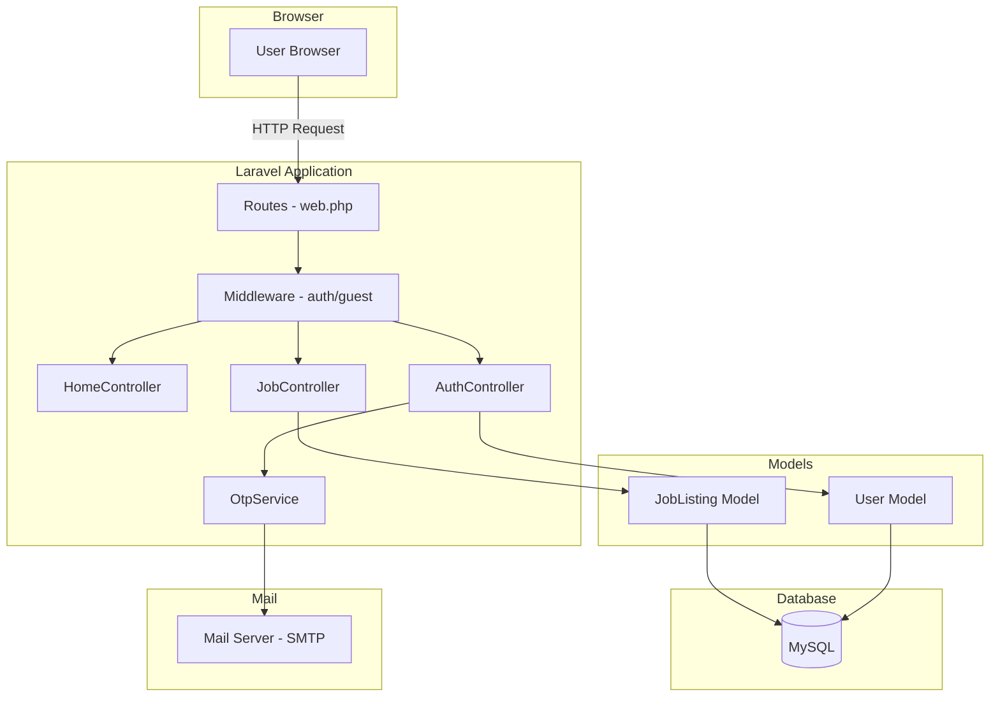
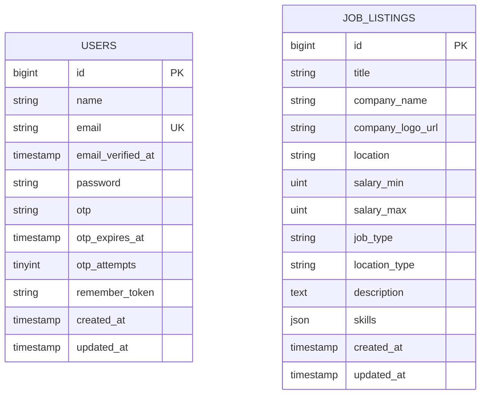

# Design Document: Job Auth System

## Overview

This design covers the implementation of job listing/detail pages, user authentication with email OTP verification, MySQL database integration, and navigation updates for the Job Hub Laravel application. The system transitions from a static home page with mock data to a database-backed platform with user accounts and persistent job storage.

The architecture follows Laravel conventions: Eloquent models, Blade views with Tailwind CSS and Alpine.js, form request validation, and session-based authentication. The OTP verification flow uses a custom lightweight service rather than a full package, keeping dependencies minimal.

### Key Design Decisions

1. **No Laravel Breeze/Fortify** — The auth flow is custom (OTP-based, no password reset), so a bespoke implementation is simpler than adapting a starter kit.
2. **Hashed OTP storage** — OTPs are stored hashed (like passwords) to prevent exposure if the database is compromised.
3. **Rate limiting via Laravel's built-in throttle** — Uses `RateLimiter` facade for OTP resend and login attempt throttling.
4. **Existing DTO pattern preserved** — The home page uses DTOs for view data; job listing/detail pages will use Eloquent models directly since data comes from the database.

## Architecture



### Request Flow

1. Browser sends request to Laravel routes
2. Middleware checks authentication state (auth/guest guards)
3. Controller handles business logic
4. Models interact with MySQL database
5. Views render Blade templates with Tailwind CSS
6. Alpine.js handles client-side interactivity (mobile menu, filters)

## Components and Interfaces

### Controllers

#### JobController

```php
class JobController extends Controller
{
    public function index(Request $request): View;   // GET /jobs - paginated listing with filters
    public function show(JobListing $job): View;     // GET /jobs/{job} - single job detail
}
```

#### AuthController

```php
class AuthController extends Controller
{
    public function showRegister(): View;                    // GET /register
    public function register(RegisterRequest $request): RedirectResponse;  // POST /register
    public function showLogin(): View;                      // GET /login
    public function login(LoginRequest $request): RedirectResponse;        // POST /login
    public function showOtpVerification(): View;            // GET /verify-otp
    public function verifyOtp(OtpVerifyRequest $request): RedirectResponse; // POST /verify-otp
    public function resendOtp(Request $request): RedirectResponse;          // POST /resend-otp
    public function logout(Request $request): RedirectResponse;             // POST /logout
}
```

### Services

#### OtpService

```php
class OtpService
{
    public function generate(User $user): string;    // Generate 6-digit OTP, hash & store, return plain OTP
    public function verify(User $user, string $otp): bool;  // Verify OTP against stored hash
    public function invalidate(User $user): void;    // Clear OTP fields on user
    public function isExpired(User $user): bool;     // Check if OTP has passed 10-minute window
}
```

### Form Requests

#### RegisterRequest

Validates: name (required, string, max:255), email (required, email, max:255, unique:users), password (required, string, min:8, max:72)

#### LoginRequest

Validates: email (required, email), password (required, string)

#### OtpVerifyRequest

Validates: otp (required, string, size:6, regex:/^\d{6}$/)

### Middleware

- `auth` — Protects routes requiring authentication (none currently, but ready for future use)
- `guest` — Redirects authenticated users away from login/register pages
- `throttle` — Applied to login and OTP resend routes

### Views

| Route | View File | Layout |
|-------|-----------|--------|
| GET /jobs | `resources/views/jobs/index.blade.php` | `layouts.app` |
| GET /jobs/{job} | `resources/views/jobs/show.blade.php` | `layouts.app` |
| GET /register | `resources/views/auth/register.blade.php` | `layouts.app` |
| GET /login | `resources/views/auth/login.blade.php` | `layouts.app` |
| GET /verify-otp | `resources/views/auth/verify-otp.blade.php` | `layouts.app` |

### Navigation Bar Updates

The existing `navigation-bar.blade.php` component will be updated to:
- Show "Login" and "Register" links when `@guest`
- Show user name (truncated to 20 chars) and "Logout" form when `@auth`
- Update "Jobs" link to point to `/jobs`

## Data Models

### Users Table (migration update)

Adds OTP columns to the existing users migration:

```php
Schema::table('users', function (Blueprint $table) {
    $table->string('otp', 255)->nullable();          // Hashed OTP
    $table->timestamp('otp_expires_at')->nullable(); // Expiration timestamp
    $table->unsignedTinyInteger('otp_attempts')->default(0); // Failed attempt counter
});
```

Note: The `otp` column stores a hashed value (using `Hash::make()`), so it needs 255 characters, not 6.

### Job Listings Table (new migration)

```php
Schema::create('job_listings', function (Blueprint $table) {
    $table->id();
    $table->string('title', 255);
    $table->string('company_name', 255);
    $table->string('company_logo_url', 2048)->nullable();
    $table->string('location', 255);
    $table->unsignedInteger('salary_min');
    $table->unsignedInteger('salary_max');
    $table->string('job_type', 50);           // Full-time, Part-time, Contract, Internship
    $table->string('location_type', 50);      // Remote, Hybrid, On-site
    $table->text('description');
    $table->json('skills');                    // JSON array of skill strings
    $table->timestamps();

    $table->index('job_type');
    $table->index('location_type');
});
```

### JobListing Model

```php
class JobListing extends Model
{
    protected $fillable = [
        'title', 'company_name', 'company_logo_url', 'location',
        'salary_min', 'salary_max', 'job_type', 'location_type',
        'description', 'skills',
    ];

    protected function casts(): array
    {
        return [
            'skills' => 'array',
            'salary_min' => 'integer',
            'salary_max' => 'integer',
        ];
    }
}
```

### User Model Updates

```php
// Add to existing User model
#[Fillable(['name', 'email', 'password', 'otp', 'otp_expires_at', 'otp_attempts'])]
#[Hidden(['password', 'remember_token', 'otp'])]

protected function casts(): array
{
    return [
        'email_verified_at' => 'datetime',
        'otp_expires_at' => 'datetime',
        'password' => 'hashed',
    ];
}
```

### Entity Relationship Diagram



## Correctness Properties

*A property is a characteristic or behavior that should hold true across all valid executions of a system — essentially, a formal statement about what the system should do. Properties serve as the bridge between human-readable specifications and machine-verifiable correctness guarantees.*

### Property 1: Job filtering and search returns only matching results

*For any* set of job listings in the database, and *for any* combination of active filters (job type, location type, salary range) and/or search term, every job returned by the query SHALL match all active filter criteria AND contain the search term (case-insensitive) in its title or company name. Additionally, results SHALL be ordered by posted date descending.

**Validates: Requirements 1.1, 1.3, 1.4, 1.7**

### Property 2: Password length validation boundary

*For any* string of length less than 8 or greater than 72 characters, the registration validation SHALL reject it. *For any* string of length between 8 and 72 characters (inclusive), the registration validation SHALL accept it as a valid password (assuming all other fields are valid).

**Validates: Requirements 3.4**

### Property 3: Password storage hashing

*For any* valid password submitted during registration, the value stored in the database SHALL NOT equal the plain text password, AND `Hash::check(plain_password, stored_hash)` SHALL return true.

**Validates: Requirements 3.7**

### Property 4: OTP generation invariants

*For any* invocation of OTP generation, the plain-text OTP returned SHALL be exactly 6 characters long and consist only of numeric digits (0-9). The value stored in the user's `otp` column SHALL NOT equal the plain-text OTP (it is hashed), and the `otp_expires_at` timestamp SHALL be approximately 10 minutes in the future.

**Validates: Requirements 4.1, 4.2**

### Property 5: OTP regeneration invalidates previous

*For any* user with an existing valid OTP, when a new OTP is generated, the previously valid OTP SHALL fail verification and only the newly generated OTP SHALL pass verification.

**Validates: Requirements 4.7**

### Property 6: Login error message uniformity

*For any* login attempt with credentials that do not match a valid account — whether the email exists in the database or not — the Auth_Controller SHALL return the same generic error message, making it impossible to determine from the response whether the email is registered.

**Validates: Requirements 5.4**

### Property 7: Error page credential concealment

*For any* database connection failure, the rendered error page SHALL NOT contain the database host, port, username, password, or driver-specific error details.

**Validates: Requirements 6.5**

### Property 8: Navigation name truncation

*For any* authenticated user whose name exceeds 20 characters, the navigation bar SHALL display at most 20 characters of the name. *For any* user whose name is 20 characters or fewer, the full name SHALL be displayed.

**Validates: Requirements 7.2**

## Error Handling

### Validation Errors

- All form submissions use Laravel Form Request classes with custom error messages
- Validation errors are flashed to the session and displayed inline next to the relevant field
- The old input (except password) is preserved on validation failure

### Authentication Errors

- Failed login: generic "These credentials do not match our records" message (no email existence leak)
- Account lockout: "Too many login attempts. Please try again in X minutes."
- OTP errors: specific messages for invalid, expired, or locked OTP states

### Database Errors

- Connection failure: custom error view (`errors/503.blade.php`) with "Service temporarily unavailable" message
- No database credentials, host, or driver details exposed in any error response
- Laravel's exception handler configured to catch `QueryException` and render safe error page

### 404 Handling

- Non-existent job IDs: custom 404 view with "Job not found" message and link back to `/jobs`
- Invalid route parameters (non-numeric job IDs): same 404 treatment via route model binding constraints

### Rate Limiting

- Login attempts: 5 per 15 minutes per email, using `RateLimiter` facade
- OTP resend: 3 per 15 minutes per email, using `RateLimiter` facade
- Throttle responses include `Retry-After` header and human-readable wait time

## Testing Strategy

### Unit Tests (PHPUnit)

Unit tests cover specific examples, edge cases, and integration points:

- **JobController tests**: pagination, filter combinations, search, empty results, page overflow redirect
- **AuthController tests**: registration flow, login flow, OTP verification, logout, guest middleware redirect
- **OtpService tests**: generation format, expiration checking, attempt tracking, throttling
- **Form Request tests**: validation rules for RegisterRequest, LoginRequest, OtpVerifyRequest
- **View tests**: navigation state (guest vs authenticated), job detail rendering, placeholder image

### Property-Based Tests (PHPUnit with custom data providers)

Property-based tests verify universal properties across randomized inputs. Since this is a PHP/Laravel project, we'll use PHPUnit's `@dataProvider` with randomized data generators to achieve property-based testing behavior (minimum 100 iterations per property).

Each property test will be tagged with a comment referencing the design property:

```php
// Feature: job-auth-system, Property 1: Job filtering and search returns only matching results
```

**Property test configuration:**
- Minimum 100 iterations per property test using data providers that generate random inputs
- Each test references its design document property number
- Tag format: `Feature: job-auth-system, Property {number}: {property_text}`

### Integration Tests

- Full registration → OTP → verification flow
- Login → session → logout flow
- Database migration verification (schema, indexes)
- Email sending (using Laravel's `Mail::fake()`)

### Test Organization

```
tests/
├── Unit/
│   ├── Services/
│   │   └── OtpServiceTest.php
│   └── Rules/
│       └── PasswordValidationTest.php
├── Feature/
│   ├── Jobs/
│   │   ├── JobListingTest.php
│   │   └── JobDetailTest.php
│   ├── Auth/
│   │   ├── RegistrationTest.php
│   │   ├── LoginTest.php
│   │   ├── OtpVerificationTest.php
│   │   └── LogoutTest.php
│   └── Navigation/
│       └── NavigationBarTest.php
└── Property/
    ├── JobFilteringPropertyTest.php
    ├── PasswordValidationPropertyTest.php
    ├── PasswordHashingPropertyTest.php
    ├── OtpGenerationPropertyTest.php
    ├── OtpRegenerationPropertyTest.php
    ├── LoginErrorUniformityPropertyTest.php
    ├── ErrorPageConcealmentPropertyTest.php
    └── NavigationTruncationPropertyTest.php
```

